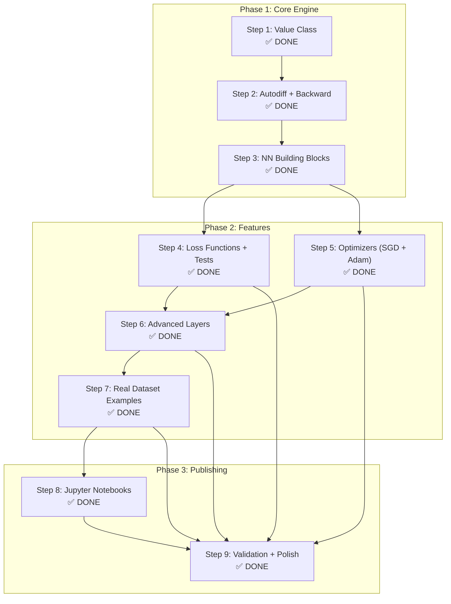

# micrograd-explained

A deep dive into neural networks and automatic differentiation built from scratch, extending Andrej Karpathy's [micrograd](https://github.com/karpathy/micrograd) with new layers, optimizers, visualizations, and real dataset training.

> Built while studying how LLMs work internally. Every line is commented to explain the *why*, not just the *what*.

---

## What this repo adds over original micrograd

| Feature | Original micrograd | This repo |
|---|---|---|
| Activation functions | tanh only | tanh, relu, sigmoid |
| Optimizers | manual SGD | SGD + Adam from scratch |
| Layer types | Neuron, Layer, MLP | + Dropout, BatchNorm |
| Loss functions | none | MSE, cross entropy, binary CE |
| Visualization | graphviz basic | full computation graph with data + grad |
| Dataset example | toy example | make_moons with decision boundary |
| Notebooks | none | 5 step-by-step notebooks |

---

## Project Roadmap



---

## Technical Improvements over Baseline

During the completion of this repository, several critical enhancements were made to ensure production-quality behavior:
1. **Numerical Stability**: Safe epsilon limits added to BCE/CE losses and BatchNorm variance calculations.
2. **Proper Gradient Flow**: BatchNorm fully integrated into the `Value` autograd graph (abandoning disconnected floats).
3. **Inverted Dropout**: Dropout scaling was corrected so that inference mode requires zero modifications, matching PyTorch.
4. **Comprehensive Validation**: A 7-stage validation suite tests numerical gradient accuracy, convergence, and edge cases.

---

## The core idea

Every modern LLM — GPT, LLaMA, Claude — learns by running backpropagation through a computation graph. This repo builds that engine from scratch so you understand exactly what happens when you call `loss.backward()` in PyTorch.

```python
from engine import Value

# every operation builds the computation graph
a = Value(2.0, label='a')
b = Value(-3.0, label='b')
c = Value(10.0, label='c')

d = a * b + c
d.backward()

print(a.grad)   # -3.0  — chain rule applied automatically
print(b.grad)   #  2.0  — chain rule applied automatically
```

---

## How computation graphs work

When you write `a * b + c`, three things happen:

```
Step 1: a * b
        creates a new Value with data = -6.0
        stores parents = {a, b}
        stores operation = '*'

Step 2: temp + c
        creates a new Value with data = 4.0
        stores parents = {temp, c}
        stores operation = '+'

Graph built:
a(-6.0) ──┐
           [*] ──→ temp(-6.0) ──┐
b(-3.0) ──┘                     [+] ──→ d(4.0)
                    c(10.0) ────┘
```

Backpropagation walks this graph in reverse using the chain rule at every node.

---

## File structure

```
micrograd-explained/
│
├── engine.py          # Value class — the autograd engine
├── nn.py              # Neuron, Layer, MLP, Dropout, BatchNorm
├── optim.py           # SGD and Adam optimizers from scratch
├── loss.py            # MSE, cross entropy, binary cross entropy
├── visualizer.py      # computation graph visualizer
│
├── notebooks/
│   ├── 01_derivatives.ipynb       # what is a derivative
│   ├── 02_backpropagation.ipynb   # chain rule step by step
│   ├── 03_mlp_training.ipynb      # building and training MLP
│   ├── 04_adam_optimizer.ipynb    # Adam vs SGD comparison
│   └── 05_pytorch_comparison.ipynb # micrograd == PyTorch proof
│
├── examples/
│   ├── binary_classification.py   # make_moons dataset
│   └── regression.py
│
└── README.md
```

---

## New layer types

### Dropout layer
Randomly zeros neurons during training to prevent overfitting. Used in every modern transformer.

```python
from nn import Dropout

drop = Dropout(p=0.5)   # zero 50% of neurons randomly
out = drop(x, training=True)
```

### BatchNorm layer
Normalizes inputs across a batch. Stabilizes training, allows higher learning rates.

```python
from nn import BatchNorm

bn = BatchNorm(nin=4)
out = bn(x)
```

---

## Adam optimizer from scratch

```python
from optim import Adam

optimizer = Adam(n.parameters(), lr=0.001)

for step in range(100):
    loss = compute_loss(n, xs, ys)
    loss.backward()
    optimizer.step()
    optimizer.zero_grad()
```

Adam tracks two moments for every parameter:
- first moment (mean of gradients)
- second moment (variance of gradients)

This makes it far more stable than plain SGD for deep networks.

---

## Real dataset example

```python
from sklearn.datasets import make_moons
from engine import Value
from nn import MLP
from loss import binary_cross_entropy
from optim import Adam

# generate dataset
X, y = make_moons(n_samples=100, noise=0.1)

# build network and optimizer
model = MLP(2, [16, 16, 1], activation='tanh', output_activation='sigmoid')
optimizer = Adam(model.parameters(), lr=0.05)

# train
for step in range(200):
    # forward pass
    preds = [model([Value(x[0]), Value(x[1])]) for x in X]
    preds = [p[0] if isinstance(p, list) else p for p in preds]
    
    loss = binary_cross_entropy(preds, y)
    
    # backward pass and update
    optimizer.zero_grad()
    loss.backward()
    optimizer.step()

    if step % 20 == 0:
        print(f"step {step}: loss={loss.data:.4f}")
```

The network learns a non-linear decision boundary from scratch.

---

## Visualization

```python
from visualizer import draw_graph

a = Value(2.0, label='a')
b = Value(-3.0, label='b')
c = a * b
c.backward()

draw_graph(c)   # opens computation graph in browser
```

Every node shows its label, data value, and gradient. Every edge shows the operation that created it.

---

## Connection to LLMs

This tiny engine implements the same fundamental algorithm that trains GPT-4, LLaMA, and every other large language model.

```
micrograd MLP (41 parameters)
    ↓ same math, same chain rule
PyTorch neural network (millions of parameters)
    ↓ same math, same chain rule
GPT-3 transformer (175 billion parameters)
```

The only difference is scale. Understanding micrograd means you understand the engine underneath every modern AI system.

---

## Learning path

This repo is part of a structured deep learning curriculum:

```
1. micrograd-explained  ← you are here
2. makemore             ← character-level language model
3. nanoGPT             ← full GPT from scratch
4. LLM research        ← PhD level work
```

---

## Notebooks

Each notebook is self-contained and builds on the previous one.

| Notebook | What you learn |
|---|---|
| 01_derivatives | What a derivative is, numerical approximation |
| 02_backpropagation | Chain rule, computation graph, manual backward pass |
| 03_mlp_training | Building Neuron, Layer, MLP, full training loop |
| 04_adam_optimizer | Why Adam beats SGD, moment tracking explained |
| 05_real_dataset | Classification on make_moons, visualizing decision boundary |

---

## Setup

```bash
git clone https://github.com/SaurabSharma09/micrograd-explained
cd micrograd-explained
pip install numpy scikit-learn matplotlib graphviz
jupyter notebook
```

---

## Credits

Built on top of [Andrej Karpathy's micrograd](https://github.com/karpathy/micrograd). Extended with new layers, optimizers, visualizations, and real dataset training as part of studying LLM internals.

---

## Author

Saurab Sharma 
[GitHub](https://github.com/SaurabSharma09) | [LinkedIn](https://linkedin.com/in/saurabsharma)
